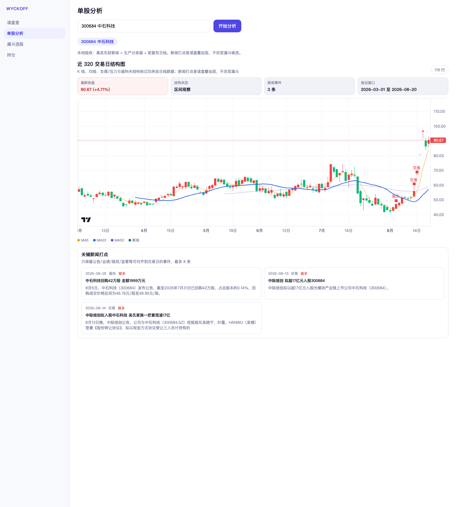
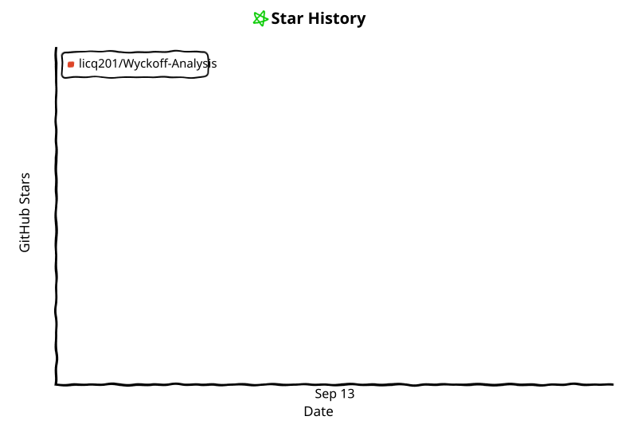

<div align="center">

# WyckoffAgent — Open-Source Wyckoff Trading Agent

**A 股 / 港股 / 美股威科夫量价分析智能体 — 你说人话，他读盘面。**

[](https://pypi.org/project/youngcan-wyckoff-analysis/)
[](https://www.python.org/)
[](LICENSE)
[](https://wyckoff-analysis.pages.dev/)
[](https://youngcan-wang.github.io/wyckoff-homepage/)

[English](docs/README_EN.md) | [架构文档](docs/ARCHITECTURE.md)

</div>

---

用自然语言和一位威科夫大师对话。系统把 A 股日线行情、威科夫结构识别、AI 研报、持仓风控、形态复盘和通知推送串成一条自动化链路，并已扩展支持港股与美股漏斗扫描。

React Web、CLI、MCP 与 GitHub Actions 共同组成当前产品形态；日线行情通过 TickFlow 实时拉取（无 Supabase 行情缓存），Supabase 仅用于用户配置、持仓、形态复盘、市场信号、信号反馈与任务结果。

> Risk disclosure: WyckoffAgent is for educational, research, and informational use. It does not provide investment advice, does not account for every personal financial circumstance, and does not guarantee future performance.

---

## 云端运行成本透明

WyckoffAgent 会始终保持开源，欢迎 fork 自行部署、提交 Issue 和 PR。  
项目的云端共享服务按付费基础设施运行：行情源、数据库、AI 报告、在线分析服务和自动化维护都会进入显性成本模型。完整成本明细与风险边界见 [docs/COST_MODEL.md](docs/COST_MODEL.md)。

---

## Special Thanks

<table>
  <tr>
    <td width="150" align="center">
      <a href="https://tickflow.org/auth/register?ref=5N4NKTCPL4">
        
      </a>
    </td>
    <td>
      <strong><a href="https://tickflow.org/auth/register?ref=5N4NKTCPL4">TickFlow</a></strong><br />
      感谢 TickFlow 为 WyckoffAgent 提供高质量 A 股 / 美股 / 港股行情数据能力支持。
    </td>
  </tr>
  <tr>
    <td width="150" align="center">
      <strong><a href="https://github.com/waditu/czsc">CZSC</a></strong><br />
      <sub>缠中说禅</sub>
    </td>
    <td>
      <strong><a href="https://github.com/waditu/czsc">缠中说禅（CZSC）</a></strong><br />
      感谢顶级交易开源项目缠中说禅（CZSC）的作者 <a href="https://github.com/zengbin93">zengbin93</a> 在交易策略上的指导与点拨。
    </td>
  </tr>
</table>

---

## 快速开始

### CLI（推荐）

```bash
# 一键安装
curl -fsSL https://raw.githubusercontent.com/YoungCan-Wang/WyckoffTradingAgent/main/install.sh | bash

# 或 Homebrew / pip
brew tap YoungCan-Wang/wyckoff && brew install wyckoff
uv pip install youngcan-wyckoff-analysis
```

维护者发布 PyPI 的自动 patch 流程与 Trusted Publishing 一次性配置见
[docs/PYPI_RELEASE.md](docs/PYPI_RELEASE.md)。

```bash
wyckoff          # 启动 Agent 对话
wyckoff dashboard  # 启动本地可视化面板
```

启动后 `/model` 选择模型（Gemini / Claude / OpenAI），输入 API Key 即可对话。

<p align="center">
  
</p>

<details>
<summary><strong>展开更多 CLI 截图</strong></summary>

| 持仓查询 | 诊断报告 | 操作指令 |
|:---:|:---:|:---:|
|  |  |  |

</details>

### Web App

在线地址：**[wyckoff-analysis.pages.dev](https://wyckoff-analysis.pages.dev/)**

<p align="center">
  
</p>

<details>
<summary><strong>展开更多 Web App 截图</strong></summary>

| 漏斗选股 | 形态复盘 |
|:---:|:---:|
|  |  |

| 持仓管理 | 单股分析（脱敏样例） |
|:---:|:---:|
|  |  |

| 新闻打点（300684 本地验收） |
|:---:|
|  |

</details>

形态复盘页按数据库实际存在的最近 30 个复盘交易日读取数据：“复盘记录”保留窗口内的数据源行数，“总入选次数”按唯一的股票+入选日统计，“覆盖股票数”和涨跌幅摘要则按股票代码去重。单股分析页会把规则过滤后的关键新闻打到 K 线上，只作读盘解释，不改变漏斗候选。服务端报错进 Cloudflare Workers Logs（约 3 天）；页面 PV/UV 用 Web Analytics；白名单用户的点击热力图走 Clarity 项目 `y6albpfin1`。这三样都不写业务库。

### Streamlit MVP 已下线

Streamlit 已经不再迭代维护，主分支已全面移除 Streamlit 运行代码。相关代码仍保留在 `release/streamlit` 分支；Streamlit MVP 时期的产品架构和效果图见 [docs/STREAMLIT_MVP_ARCHITECTURE.md](docs/STREAMLIT_MVP_ARCHITECTURE.md)。

### 本地可视化面板（Dashboard）

```bash
wyckoff dashboard
```

<p align="center">
  
</p>

<details>
<summary><strong>展开更多 Dashboard 截图</strong></summary>

| 形态复盘 | 信号池 |
|:---:|:---:|
|  |  |

| 持仓 | Agent 记忆 | 后台任务 |
|:---:|:---:|:---:|
|  |  |  |

| 对话日志 | 同步状态 | 对话日志详情（Trace） |
|:---:|:---:|:---:|
|  |  |  |

</details>

### 定时任务常驻（macOS launchd）

定时任务默认只在 TUI 打开时运行 —— 关掉窗口就停。装上 daemon 后它独立常驻，关 UI 也继续跑：

```bash
scripts/daemon_install.sh      # 装成 launchd 用户级服务
wyckoff daemon --status        # 看运行状态
tail -f ~/.wyckoff/logs/daemon.log
scripts/daemon_uninstall.sh    # 卸载
```

daemon 持锁时 TUI 会自动让出调度权，两边不会重复触发。

**无人监督时的写操作策略。** daemon / `wyckoff run` 先恢复本机已保存的 CLI 登录态，再跑工具；
否则自动止损会写到本地 `USER_LIVE:local` 而不是云端持仓。daemon 只会自己执行 `set_stop_loss` ——
这个工具只能改止损价，签名里没有股数、成本、现金，不移仓也不花钱。其余全部进待批准队列，
并绑定入队时的账户；换号后不能批准别人的项：

```bash
wyckoff approve list           # 看待批项
wyckoff approve ok <id>        # 批准并立即执行队列中保存的精确参数
wyckoff approve no <id>        # 拒绝
```

`approve list` 会展示脱敏后的完整参数；`approve ok` 通过正常工具注册表立即执行并记录结果，
失败不会自动重试，避免重复成交。待批项 12 小时后过期且不可批准 —— 隔夜的调仓会按旧价成交。

也可以手动跑一轮，不进 TUI：

```bash
wyckoff run "盘前风控检查"
```

### 接入外部 MCP server

第三方 MCP server（GitHub、文件系统、你自己的数据源）的工具可以接进同一个会话，
和原生工具走同一套审批闸门。需要 mcp 依赖：`uv pip install -e '.[mcp]'`。

```bash
wyckoff mcp-add github --command npx \
  --args -y @modelcontextprotocol/server-github \
  --env GITHUB_TOKEN              # 从当前环境读取，避免把值写进命令历史

wyckoff mcp-test github     # 先试连，列出工具，不进会话
wyckoff mcp-enable github   # 确认没问题再启用
wyckoff mcp-list
```

**接一个 server 等于允许在本机 spawn 它的命令**，所以：新增后默认未启用，
配置只能你自己写（模型不能新增 server），本项目自建的 `mcp_server.py`
会被拒绝接入（工具已内置，接第二遍只会出现两份同名工具）。

外部工具名带 `mcp__<server>__` 前缀，不会顶掉原生工具。写操作按工具名和
`annotations` 启发式识别 —— **认不出就当写**，进待批准队列。daemon 无人时
永不自动执行外部写入。

某个 server 连不上只会让它自己不可用，原生工具照常。
错误看 `~/.wyckoff/logs/mcp-<server>.log`。

### 回测网格

<p align="center">
  
</p>

<details>
<summary><strong>展开更多回测截图</strong></summary>

| 参数矩阵 |
|:---:|
|  |

</details>

---

## 功能亮点

- **对话式 Agent** — 用自然语言触发诊断、筛选、研报；CLI、Web、MCP 各自按权限编排多工具
- **主线漏斗筛选** — A 股全市场约 5000 股动态发现概念主线、八通道强度、候选车道和买点确认；NEUTRAL 主线优先，RISK_ON 禁新开
- **日漏斗 × 次日开盘串联** — 漏斗定候选与环境，跨日 confirmed 后由 OMS 给出唯一允许买入区间，开盘价在区间内才执行；报告顶部固定「执行纪律」
- **跨市场** — A 股 / 港股 / 美股漏斗独立 workflow
- **AI 三阵营研报** — 逻辑破产 / 储备营地 / 起跳板，LLM 独立审判
- **信号反馈闭环** — 漏斗记录 observations，盘后 feedback 聚合 health / registry，支持 shadow 动态策略验证
- **持仓诊断 & 私人决断** — 单股质量先于账户角色；WARNING 只观察，确认破位/硬风险才产生 EXIT/TRIM；非主线 5 日进入复核但不机械卖出
- **Agent 分层记忆** — L1 原子记忆 + L2 场景 + L3 画像，FTS5/代码/关键词混合召回并保留来源追溯
- **Skills 扩展** — 内置 `/screen`、`/checkup`、`/report`、`/backtest`，用户可自定义
- **Prompt 模板** — 内置 `/daily`、`/review-l4`、`/step3-audit` 等高频投研模板，也支持 `~/.wyckoff/prompts/*.md`
- **模型元数据与成本可见性** — `wyckoff model list/usage/cost` 展示上下文窗口、reasoning 能力和本地 token 成本估算；OpenRouter 模型的上下文窗口取自其 `/models` 接口的真实值（`wyckoff model refresh` 刷新），不靠模型名猜
- **会话分叉与导出** — `wyckoff session export/fork` 或 TUI `/fork` 把历史对话变成可复盘、可继续的新分支
- **标准事件流** — `wyckoff trace --events <scratchpad.jsonl>` / `wyckoff diag` 产出统一 JSONL，方便复盘工具调用时间线
- **独立边缘后端** — React 统一调用 Hono Worker；后端提供请求 ID、安全响应头、请求体上限、Redis 共享限流和白名单沙箱任务。读盘室的研究计算必须经用户确认，先进入单并发 Cloudflare Queue，再由签名的 Node 执行桥进入无网络、自动销毁的 Vercel Sandbox；每用户同时仅一个任务，并按日限制创建次数与实际 CPU 用量。Worker 与 bridge 用 `requestId`/`runId` 输出不含脚本与密钥的结构化执行日志，本地支持 VS Code 断点与 `workerd` 集成测试
- **观察篮临时行情** — 只为当前问题拉取相关 TickFlow 报价，浏览器快照 45 秒后失效，不写入 Redis 或业务数据库
- **依赖卫生检查** — CI 运行 `scripts/check_dependency_hygiene.py`，提示 Python/Web 依赖锁定和 lockfile 风险
- **测试隔离与单次覆盖率** — pytest 不读取本机 `.env`、底层 socket 默认断网；CI 只执行一次 coverage-instrumented Python 全量套件并复用结果生成覆盖率 artifact
- **MCP Server** — 18 个工具通过 MCP 协议对外暴露，Claude Code / Cursor 即插即用；包含研究假设与证据台账
- **多通道推送** — 飞书 / 企微 / 钉钉 / Telegram
- **本地面板** — `wyckoff dashboard` 一条命令启动可视化

---

## 演示视频

<details>
<summary><strong>「从0到1读盘」Web 全流程（读盘室→设置）</strong></summary>


</details>

<details>
<summary><strong>「终端党最爱」CLI 流程（启动→执行→结果）</strong></summary>


</details>

---

## 文档导航

每类事实只在一份主文档中详细维护，其余页面只做摘要和链接：

| 权威内容 | 唯一主文档 |
|----------|------------|
| 技术架构、Actions 总表、数据表、缓存 | [docs/ARCHITECTURE.md](docs/ARCHITECTURE.md) |
| **A 股主漏斗的阶段顺序与上下游数据流** | [docs/A_SHARE_FUNNEL_FLOW.md](docs/A_SHARE_FUNNEL_FLOW.md) |
| 信号反馈实现、shadow/on 动态策略 | [docs/SIGNAL_FEEDBACK_LOOP.md](docs/SIGNAL_FEEDBACK_LOOP.md) |
| 研究路线、证据门槛与晋级治理 | [docs/ITERATION_STRATEGY.md](docs/ITERATION_STRATEGY.md) |
| 运营成本、规模化预算 | [docs/COST_MODEL.md](docs/COST_MODEL.md) |
| 策略语义：漏斗、AI 研报、OMS、回测 | [README_STRATEGY.md](README_STRATEGY.md) |
| **实盘操作（日漏斗×次日开盘）** | [docs/OPERATOR_PLAYBOOK.md](docs/OPERATOR_PLAYBOOK.md) |
| 术语速查 | [GLOSSARY.md](GLOSSARY.md) |
| MCP Server 配置 | [docs/ARCHITECTURE.md](docs/ARCHITECTURE.md#mcp-server) |
| 密钥、Actions Secrets 与本地配置 | [docs/ARCHITECTURE.md](docs/ARCHITECTURE.md#云端存储supabase) |

> **Wiki 深度阅读**：[交易方法论 Wiki](https://github.com/YoungCan-Wang/WyckoffTradingAgent/wiki/02_Finance_Wyckoff_Method) ｜ [技术架构 Wiki](https://github.com/YoungCan-Wang/WyckoffTradingAgent/wiki/09_Tech_Architecture)。Wiki 解释方法和设计取舍，不重复维护配置值、工作流清单或数据表契约。

---

## 配置

**零配置即可使用** — 启动后 `/model` 添加 LLM API Key 即可对话。

进阶配置见 [架构文档](docs/ARCHITECTURE.md)。

> 数据源购买：[TickFlow →](https://tickflow.org/auth/register?ref=5N4NKTCPL4) ｜ 大模型购买：[1Route →](https://www.1route.dev/register?aff=359904261)

---

## 交流

如果你希望免去行情数据源、数据库、云服务器、AI API 和自动化任务的运维成本，可以加入 **「威科夫策略交流学习」知识星球**，使用云端共享入口：多端同步、每日全市场漏斗推送、自动 AI 研报和专属交流社区都由共享基础设施统一承载。

年费 **CNY 518/年**，折合每天约 **1.4 元**。518 取“我要发”的好彩头；这笔费用主要用于共同平摊系统运维硬成本，不是投资顾问费，也不构成任何收益承诺。成本明细与风险边界见 [docs/COST_MODEL.md](docs/COST_MODEL.md)。

<p align="center">
  
</p>

| 飞书一群 | 飞书二群 | QQ群 | 飞书个人 |
|:---:|:---:|:---:|:---:|
|  |  | <br/>群号: 761348919 |  |

## 赞助

觉得有帮助？给个 Star。赚到钱了？请作者吃个汉堡。

| 支付宝 | 微信 |
|:---:|:---:|
|  |  |

## License

[AGPL-3.0](LICENSE) &copy; 2024-2026 youngcan

---

<!-- star-history:start -->
<picture>
  <source media="(prefers-color-scheme: dark)" srcset="assets/star-history/star-history-dark.svg">
  
</picture>
<!-- star-history:end -->
